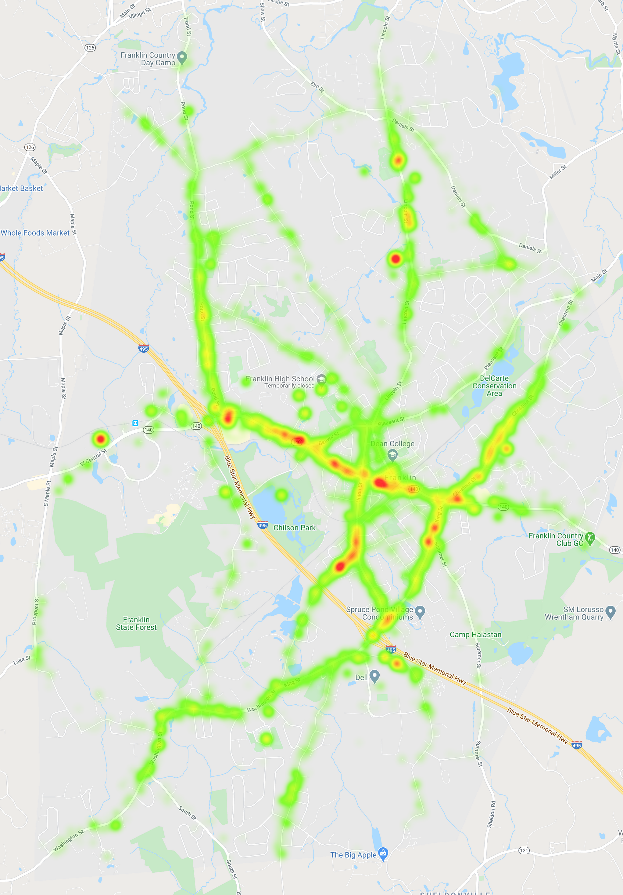

# Police Plotter
A quick-n-dirty solution to plot police activity in my town.
I was curious if there was a pattern to where traffic stops occured where I live. Luckily, all police incidents are logged and available to the public on my town website. I wrote some code to download all files from my town website, parse the data, and store them in a sqlite database.
I then created a heatmap in Google Maps, which can be viewed and modified in visulizer.ipynb.

## Plotting
All the data has been downloaded and parsed up to 5-28-2020 and goes back to 1-1-2017. To plot with Google Maps, you need to obtain an API key and set/export it as an environment variable.

### Frequency of "Motor Vehicle Violations" between 2017-2020 in Franklin, MA

